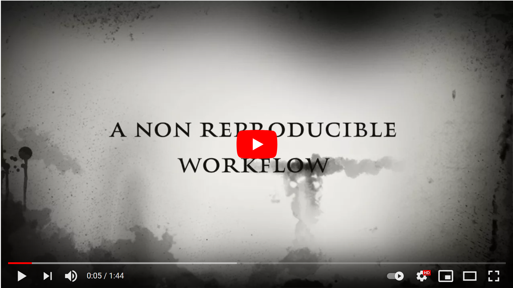
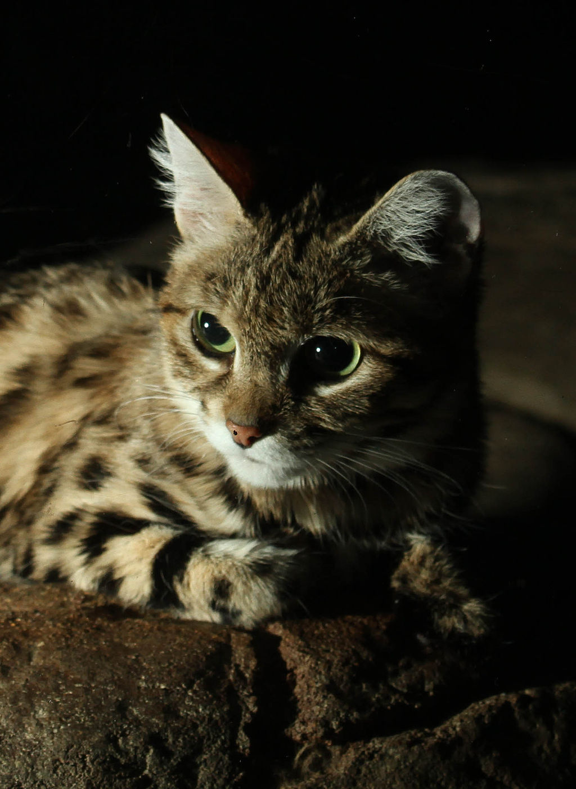

\newpage

# Why are we here?
[](https://www.youtube.com/watch?v=s3JldKoA0zw\\&t=5s)


\newpage
# Introducing RMarkdown
That's why we are playing around with `RMarkdown` today.  
Clearly, there's no best way of doing so than throwing in a bunch of *Cats*.
```{r, echo=F, warning=F, fig.align="center", fig.height=1.5, fig.width=3, dpi=200}
### Hidden  code to create the KateR sticker
library(hexSticker)
library(cowplot)
imgurl <- "http://raw.githubusercontent.com/GuangchuangYu/hexSticker/master/inst/figures/cat.png"
sticker(imgurl, package="KateRMd", p_size=15, s_x=1, s_y=.75, s_width=.6,
        filename="figures/KateRMD_sticker.png")

plot_grid(
  ggdraw() +
    draw_image("figures/rmarkdown.png"),
  ggdraw() +
    draw_image("figures/KateRMD_sticker.png"),
  nrow=1)

```


## Why RMarkdown
RMarkdown is the easiest way to create interactive documents integrating text, code and output from your code. It is fairly versatile, has a shallow learning curve and, as it often happens in R, there is a bunch of people continuously expanding its functionalities and possibilities.  

For instance, you can:  

* Compile a single R Markdown document to a report in different formats, such as PDF, HTML, or Word.
* Create notebooks in which you can directly run code chunks interactively.
* Make slides for presentations (HTML5, LaTeX Beamer, or PowerPoint).
* Produce dashboards with flexible, interactive, and attractive layouts.
* Build interactive applications based on Shiny.
* Write journal articles.
* Author books of multiple chapters.
* Generate websites and blogs.
<br>

Yes, you guessed that. This very document has been generated using `RMarkdown`.  
<br>
Not all that glitters is gold, though. Expect headaches when setting up your (especially Windows) machine to work if interested in knitting pdfs or more advanced stuff.

## Briefest history on RMarkdown ever
Source: https://bookdown.org/yihui/rmarkdown/  
The document format “R Markdown” was first introduced in the knitr package (Xie 2015, 2020c) in early 2012. The idea was to embed code chunks (of R or other languages) in Markdown documents. 

However, the original version of Markdown invented by John Gruber was often found overly simple and not suitable to write highly technical documents. For example, there was no syntax for tables, footnotes, math expressions, or citations. Fortunately, John MacFarlane created a wonderful package named Pandoc (http://pandoc.org) to convert Markdown documents (and many other types of documents) to a large variety of output formats. More importantly, the Markdown syntax was significantly enriched. Now we can write more types of elements with Markdown while still enjoying its simplicity.

In a nutshell, R Markdown stands on the shoulders of knitr and Pandoc. The former executes the computer code embedded in Markdown, and converts R Markdown to Markdown. The latter renders Markdown to the output format you want (such as PDF, HTML, Word, and so on).

The rmarkdown package (Allaire, Xie, McPherson, et al. 2020) was first created in early 2014. 

## What's Markdown
[Markdown](https://www.markdownguide.org/getting-started/) is a lightweight markup language that you can use to add formatting elements to plaintext text documents. Created by John Gruber in 2004, Markdown is now one of the world’s most popular markup languages.

It's the language used to create README's and Project descriptions in GitHub

## What's Latex
[Latex](https://www.latex-project.org/about/) which is pronounced «Lah-tech» or «Lay-tech» (to rhyme with «blech» or «Bertolt Brecht»), is a document preparation system for high-quality typesetting. It is most often used for medium-to-large technical or scientific documents but it can be used for almost any form of publishing.

LaTeX is not a word processor! Instead, LaTeX encourages authors not to worry too much about the appearance of their documents but to concentrate on getting the right content.  

You need LaTex only for knitting to pdf documents. If you're happy with html notebooks, there's no need of installing it.

## What's Pandoc

If you need to convert files from one markup format into another, [pandoc](https://pandoc.org/) is your swiss-army knife.  

The good news is that your RStudio IDE has already a Pandoc installation embedded! Maybe it's not the latest, but it will work just fine most of the times.

# Can we look at cats now?
Almost. Fire up your RStudio and install `RMarkdown` first.
```{r, eval=F}
install.packages("rmarkdown")
```

Time to start your first `RMarkdown` document. 

File -> New File -> R Markdown

```{r, echo=F, warning=F, fig.align="center", fig.height=3, dpi=300}
plot_grid(
  ggdraw() + 
    draw_image("figures/Fig1.PNG"),
  ggdraw() + 
    draw_image("figures/Fig2.PNG"),
  nrow=1)
```
We'll stick to html today. Knitting documents to pdf is undoubtedly cooler, but requires installing Latex, which might be tricky, depending on the machine one is using.  
\newline

*Congratulations* - You've just created your first `RMarkdown` document.

## What am I seeing?
You should be seeing something like this:
```{r, echo=F, warning=F, fig.align="center", fig.height=2, dpi=300}
ggdraw() + 
  draw_image("figures/Fig3.PNG")
```
The first part is called the metadata.  
The metadata is written between the pair of three dashes --- The syntax for the metadata is YAML (YAML Ain’t Markup Language, https://en.wikipedia.org/wiki/YAML), so sometimes it is also called the YAML metadata or the YAML frontmatter. Before it bites you hard, we want to warn you in advance that indentation matters in YAML, so do not forget to indent the sub-fields of a top field properly.  
(Source - https://bookdown.org/yihui/rmarkdown/basics.html).  
It sounds intimidating. However, you won't have to do much with your metadata most of the time, besides copy pasting it from a template. Pheeeewww!  
\newline

In the rest of the script you can distinguish between text and *chunks* of code. Note how chunks of code are enclosed by three **backtick** signs.  
```{r, results='asis', echo=FALSE}
cat("`` ``` ``")
```
\newline

If you can't find the backtick sign in your keyboard, try with the ASCI code: `Alt`+`96`.

\newpage

Look at the two buttons highlighted by the arrows.  

* *Insert* --- allows you to add a new chunk of code.  
* *Knit* --- renders your document to the preferred file type.  

## What happens when I `knit` my notebook?
`Knitting` your `RMarkdown` script means rendering it to your chosen output (html in this case). There is quite a lot of machinery (=dark magic) happening behind the scenes. Fortunately, for most applications we don't have to understand how these happen. Just enjoy the result.

```{r, echo=F, warning=F, fig.align="center", fig.height=3, dpi=300, fig.cap="Workflow - Source: 'https://bookdown.org/yihui/rmarkdown-cookbook'"}
ggdraw() + 
  draw_image("figures/workflow.png")
```


## How to create a beautiful `RMarkdown` document?
### Playing around with Text
Let's start with the easiest. How to add text (=**narrative**), to my `RMarkdown.` Easy-peasy. Just type!  

You just need to know a couple of things:  
Going to new line -> Need to add *two whitespaces* at the end of a block of text.  
Leaving an empty line -> Two ways: 1. `<br>`, 2.`\newline` (followed by an empty line).  
\newline

Titles and Headers:  
`# Header` - Header 1  
`## Header` - Header 2  
`### Header` - Header 3  
\newline

Basic formatting. You can use some basic markdown formatting to make your text:  
Italic: \*Felis catus\* --> _Felis catus_  
Italic: \_Felis catus\_ --> _Felis catus_  
Bold: \*\*Felis catus\*\* --> **Felis catus**  
Bold: \_\_Felis catus\_\_ --> __Felis catus__  
Both: \*\*\*Felis catus\*\*\* --> ***Felis catus***  
Both: \_\_\_Felis catus\_\_\_ --> ___Felis catus___
\newline

Adding Lynx:  
`[Eurasian Lynx - Wikipedia](https://en.wikipedia.org/wiki/Eurasian_lynx)`  
Renders as:  
[Eurasian Lynx - Wikipedia](https://en.wikipedia.org/wiki/Eurasian_lynx) 
\newline

Embed a cat image from url/file:    
`<center>`
`{height=300px}`
`</center> `
\newline

Renders as: 
\newline

<center> 
{height=300px}
</center> 
Note how I used the html tags `<center>` & `</center>` to give additional graphical indications. This is one cool thing of RMarkdown: Not only it understands R and Markdown, but also html and (if Latex is installed on your machin) Latex!
\newline
  
--- 

Let's see now how to create **numbered lists** of cats (don't forget to leave an empty line before starting the list). E.g.,    
My favourite wildcats:  

`1. Andean Cat (*Leopardus Jacobita*)`  
`2. Rusty Spotted Cat (*Prionailurus Rubiginosus*)`  
`3. Chinese Mountain Cat (*Felis Bieti*)`  
`4. Kodkod (*Leopardus Guigna*)`  

Renders as:

1. Andean Cat (*Leopardus Jacobita*)
2. Rusty Spotted Cat (*Prionailurus Rubiginosus*) 
3. Chinese Mountain Cat (*Felis Bieti*)
4. Kodkod (*Leopardus Guigna*)


Create unordered lists of cats:   

Where small cats live:  

| `* Small Cats of South America`
|   `+ Andean Cat`
|   `+ Geoffroy’s Cat`
|   `+ Jaguarundi`
|   `+ ...`
| `* Small Cats of SE Asia  `
|   `+ Leopard Cat  `
|   `+ Marbled Cat  `
|   `+ Fishing Cat  `
|   `+ ...  `

Renders as:

* Small Cats of South America
  + Andean Cat
  + Geoffroy’s Cat
  + Jaguarundi
  + ...
* Small Cats of SE Asia
  + Leopard Cat
  + Marbled Cat
  + Fishing Cat
  + ...

Sometimes, we want to add a comment to our RMarkdown, as a reminder of something we still need to develop, but that we don't want to show in our rendered report. This is the syntax:  
`<!-- REMEMBER TO ADD THE INSTRUCTIONS TO MAKE COMMENTS -->`  
But nothing will be shown!


**Do Yourself a Favour** - and download the catsheet (=cheatsheet)  
[Catsheet](https://rstudio.com/wp-content/uploads/2015/02/rmarkdown-cheatsheet.pdf) - 
https://rstudio.com/wp-content/uploads/2015/02/rmarkdown-cheatsheet.pdf


### Playing around with Code
To  insert a chunk of code, just enclose it between three backticks, followed by {r}:  
```{r, results='asis', echo=FALSE}
cat("`` ```{r}``")
```
\newline

```{r, results='asis', echo=FALSE}
cat("`` 4+4 ``")
```
\newline

```{r, results='asis', echo=FALSE}
cat("`` ``` ``")
```
\newline

It will render as:
```{r}
4+4
```


Let's make some practice. We need to import some cat-related data, first. 
```{r }
#download the file first:
if(!file.exists("data")){dir.create("data")}
download.file(url="https://raw.githubusercontent.com/fmsabatini/KateRMarkdown/main/data/Wikipedia_LargestCats.txt", 
              destfile="data/Wikipedia_LargestCats.txt")


# Load the table
big.cats <- read.table("data/Wikipedia_LargestCats.txt", header = T)
big.cats$Common.name <- factor(big.cats$Common.name, levels=big.cats$Common.name) #refactor - improves ordering later
big.cats
```
This data.frame contains the weight range, and the maximum observed weights and lengths of the ten largest wildcats. (Source: [Wikipedia](https://en.wikipedia.org/wiki/List_of_largest_cats)).  
\newline


Maybe in your report you want to automatically include a value which you calculate in your r script. This can be done with some *inline code*. This can be done enclosing some code by backticks and specifying the code is in r. For instance the code:    
```{r, results='asis', echo=FALSE}
cat("`` The cat having the highest weight is `r big.cats[1,'Common.name']`. ``")
```
```{r, results='asis', echo=FALSE}
cat("`` It weights up to `r big.cats[1,'Maximum.weight.kg']`. ``")
```


Renders as:  
The cat having the highest weight is `r big.cats$Common.name[1]`.  
It weights up to `r big.cats$Maximum.weight.kg[1]`.  
\newline


A couple of useful arguments when you start your chunk:  
`{r echo=F}` --- For running your code in the background, without showing the code itself.  
`{r eval=F}` --- Opposite. For showing your code, but without actually running it.  


### Playing around with Pictures
**THE THING** about `RMarkdown` is that it allows embedding graphs directly to your document. Input changed? Just re-knit and you'll have all your graphs updated. It's as easy as simply running a chunk of code.  

First thing, we load `tidyverse` a set of powerful packages for data manipulation and visualization, which includes the package `ggplot2`
```{r}
library(tidyverse)
```

When loading tidyverse, we are getting a bunch of warning messages. Not so nice in a report. You can deactivated them by opening your chunk with `{r, warning=F, message=F}`.
\newline


Let's make a graph to see the differences in cat size more easily, through a forest plot.
We install the fantastically useless package `cat` first. It's not on CRAN, therefore we need also the package `remotes`. All it does is randomly selecting a cat image to be used as background of our ggplot graphs. 
```{r, eval=F}
install.packages("remotes")
remotes::install_github("hilaryparker/cats") 
```

We can then load the package and use it to get our much needed random cat image
```{r}
library(cats)
ggcats <- ggplot(data=big.cats) + 
  cats::add_cat() + ## add a random cat image on the background of the graph, if you fancy
  geom_segment(aes(y=Common.name, yend=Common.name, x=Weight.min, xend=Weight.max), 
               arrow = arrow(length = unit(5, "points"), 
                             ends="both", type = "closed", angle = 40)) + 
  ylab(NULL) +
  xlab(NULL) + 
  theme(axis.text = element_text(size=14))
ggcats
```

Some useful figure related arguments here:  
`{r fig.height=3}` - picture height in inches  
`{r fig.width=3}` - picture width in inches  
`{r fig.cap="add caption here"}` - Add a caption  
`{r fig.align="center"}` - Horizontal alignment of your graph  
`{r dpi=150}` - Change resolution of output image (mostly relevant for pdf)  

You can also combine them altogether in a single line. For instance, if I rerun the chunk above specifying:  
`{r, fig.height=3, fig.width=4, fig.cap="Weight (kg) of the 10 largest wild cats",`   `fig.align="center", dpi=150, echo=F}`  
```{r, fig.height=3, fig.width=4, fig.cap="Weight (kg) of the 10 largest wild cats", fig.align="center", dpi=150, echo=F}
ggcats
```

Note how the code isn't visible anymore, having set `echo=F`. I swear it's there, though.  

\pagebreak


### Playing around with Tables
If you just print an R object on the console as we did above, `RMarkdown`, will show it in the rendered document as well. It won't look that good, though.  


The entry level way of rendering tables is the `knitr::kable` function.  
```{r}
knitr::kable(head(big.cats[1:4,1:5]), caption="The largest cats!")
```

An even nicer way is using the `kableExtra` package. For instance, when rendering to html, `kableExtra` allows the creation of responsive tables. This is extremely useful for tables larger than a A4 format.  
```{r, warning=F, message=F, echo=T, eval=F}
library(kableExtra)
knitr::kable(big.cats, caption="The largest cats!") %>%
  kable_styling(
    bootstrap_options = c("striped", "hover", "condensed", "responsive"), 
    position = "center")
```


```{r, warning=F, message=F, echo=F}
library(kableExtra)
mytable <- knitr::kable(big.cats, caption="The largest cats!") %>%
  kable_styling(
    bootstrap_options = c("striped", "hover", "condensed", "responsive"), 
    position = "center")
```

`r if (!knitr::is_html_output()) '<!--'`
`r mytable`
`r if (!knitr::is_html_output()) '-->'`


I won't look good that good on a pdf, but on an html report it's just as good as it can possibly be.  

### Playing around with References

Yes, it is possible to add references to your markdown document. There are multiple ways for doing it. [You can even link your Zotero library](https://www.r-bloggers.com/2019/02/bibliography-with-knitr-cite-your-references-and-packages/), if you wish. However, the easiest is probably to use the `knitcitations` package. We load it first.  

```{r, echo=F, warning=F}
library(knitcitations)
```

```{r, eval=F}
install.packages("knitcitations")
library(knitcitations)
```


We can now cite online any work simply by referring to its doi. How?

The text:  
```{r, echo=F, comment=""}
cat("Cats are not necessarily animals `r citep('10.1007/s10670-022-00588-w')`. But if they are, they should be left free to roam `r citep('10.1007/s12136-019-00408-x')`")
```
will render as:  

<br>
Cats are not necessarily animals `r citep('10.1007/s10670-022-00588-w')`.But if they are, they should be left free to roam `r citep('10.1007/s12136-019-00408-x')`

<br>
To create a bibliography, we need to use the respective command.
```{r}
bibliography()
```
...and yes, you can also change the format style, but it is a bit laboursome and we don't deal with this aspect here.


\newpage
# Slightly more advanced stuff
## Long computing times
Whenever you knit your `RMarkdown` report, R will re-run all the code contained in your .Rmd script. It's therefore not the best idea to include a chunk of code taking 3 hours to run. If you do so, even just correcting a typo in the text will require you to wait three hours before the corrected version of your report is rendered!  

There are a couple of workarounds, though.  

1) add the argument `{r cache=T}` to your chunk:    
Adding this argument to the slowest chunks of code will save the intermediate results of these chunks in a dedicated folder. `RMarkdown` will *only* rerun these chunks when changed. Otherwise, it will skip the chunk, and get directly the cached results.  \newline

2) `{r eval=F}` + save and load  
Sometimes, it might be more convenient to run slow chunks of code in a dedicated, interactive session (maybe even on a different machine), save the results in a `.RData` file, and reload this saved data in your report. For transparency, you might still show the code you used to produce these intermediate outputs, but setting eval=F, you'll tell RMarkdown not to run this code.  
\newline 

Something like this.  
Chunk 1 with slow code I ran elsewhere:

```{r, results='asis', echo=FALSE}
cat("`` ```{r eval=F} ``")
```

```{r, results='asis', echo=FALSE}
cat("`` output <- function(input) # A real SLOW chunk of code  ``")
```
\newline

```{r, results='asis', echo=FALSE}
cat("`` save(output, filename='output.slow.RData')  ``")
```
\newline

```{r, results='asis', echo=FALSE}
cat("`` ``` ``")
```

Chunk 2 reimporting the output of chunk 1:

```{r, results='asis', echo=FALSE}
cat("`` ```{r}``")
```
\newline

```{r, results='asis', echo=FALSE}
cat("`` load(filename='output.slow.RData') ``")
```
\newline

```{r, results='asis', echo=FALSE}
cat("`` ``` ``")
```


## Alternative ways of knitting
Clicking on the `knit` button is convenient. The keyboard shortcut `Ctrl``Alt``k` is even more.  
Sometimes, you might want to knit multiple documents (Yes, you might loop across several `.Rmd` scripts, and knit hundreds of reports in parallel). To do so, you might want to knit an `.Rmd` file from console as:

```{r, eval=F}
knitr::knit("KateRMarkdown.Rmd")
```

```{r, fig.align="center", fig.height=2, dpi=150, echo=F}
ggdraw() + 
  draw_image("figures/MindBlowing.jpg")
```

Similarly, sometimes it can be convenient to knit a simple .R script to a pdf document (Warning! Latex installation needed!). The `knitr` package allows that, just follow the template code below:

```{r, eval=F}
library(knitr)
knitr::stitch("myscript.R", 
       template=system.file("misc", "knitr-template.Rnw",package="knitr"))
```


## PDFs and paper templates
I know. You you can't wait to produce your fantastic pdf reports, and write your next paper directly in R.  
Good news - is possible - There are many templates out there, and you just have to fetch them. See for instance: https://t.co/uJBqWER5h6?amp=1  
**Yes, there are templates which will also format bibliographic reference as requested by different journals**

Bad news - you'll need to setup your machine first, and it might be tricky sometimes. You find some guidance at: [https://bookdown.org/yihui/rmarkdown-cookbook/install-latex.html](https://bookdown.org/yihui/rmarkdown-cookbook/install-latex.html).   


# Resources
Many good resources out there. I only cite two:  

1) [Bookdown](https://bookdown.org/yihui/rmarkdown/) - https://bookdown.org/yihui/rmarkdown/  
2) [RMarkdown Cookbook](https://bookdown.org/yihui/rmarkdown-cookbook/) - https://bookdown.org/yihui/rmarkdown-cookbook/  


\newpage
# Your Turn!
Now it's up to you to create a beautiful `RMarkdown` report full of cats. The more \\ the cuter the cats, the better. 
\newline

Pick up a cute, wild species of cat and:  

1) Set up a new `RMarkdown` project  
2) Report a fun fact about your cat species as text in your report  
3) Embed a (copyright free) picture of that cat from the internet  
4) Download some data on that cat from [gbif](https://www.gbif.org/) using the `rgbif` package (help code below)  
5) Show the data in a table
6) Create one graph based on that data (for instance a bar chart of the species occurrences across countries or sampling years, or a map of the coordinates). Any graphs work     
7) Knit your project to html
8) Upload your html report at: [https://portal.idiv.de/nextcloud/index.php/s/dK5Cdi68aD2Eees](https://portal.idiv.de/nextcloud/index.php/s/dK5Cdi68aD2Eees). I will publish the nicest reports in the [KateRMarkdown](https://github.com/fmsabatini/KateRMarkdown) gallery.  

*Help code to download data from [gbif](https://www.gbif.org/)*
```{r, eval=F, warning=F}
library(tidyverse)
library(rgbif)
myspecies <- "Caracal caracal"  ## example
get.speciesKey <- function(x){name_backbone(x)$speciesKey} #get GBIF species key
key <- get.speciesKey(myspecies)
# extract the first n occurrences from rgbif
get.occurrences <- function(x, n=100){occ_search(taxonKey=x, return="data", 
                                             limit=n, hasCoordinate = T)}
# clean data
dat <- lapply(key, get.occurrences, n=100)[[1]]
dat <- dat$data  %>%  
  dplyr::select(species, year:day, country, stateProvince, 
                decimalLongitude, decimalLatitude)#, everything())
```

\newpage
# sessionInfo()
```{r}
sessionInfo()
```


